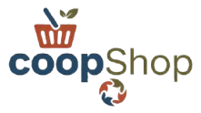

<div align="center">
  
  <h1>🛍️ Cooporia</h1>
  <p><b>La première plateforme e-commerce dédiée aux coopératives marocaines</b></p>

  [](https://dotnet.microsoft.com/apps/aspnet/mvc)
  [](https://dotnet.microsoft.com/)
  [](LICENSE)
</div>

---

## 🌟 À propos de Cooporia

**Cooporia** est une plateforme e-commerce moderne conçue pour mettre en lumière le savoir-faire des coopératives marocaines. Elle permet aux consommateurs du monde entier de découvrir et d'acheter des produits authentiques (terroir, artisanat, cosmétique) tout en soutenant directement l'économie sociale et solidaire au Maroc.

## ✨ Fonctionnalités Clés

### 👤 Espace Client
- **Catalogue Intelligent** : Recherche facilitée par filtres avancés (prix, catégories, régions).
- **Chatbot IA** : Un assistant virtuel (Gemini AI) disponible 24/7 pour conseiller les clients.
- **Panier & Favoris** : Gestion fluide des achats et liste de souhaits.
- **Suivi en Temps Réel** : Historique des commandes et suivi de livraison intégré.
- **Paiement Sécurisé** : Option de paiement à la livraison.

### 🛠️ Espace Administration
- **Tableau de Bord** : Statistiques de ventes et analyse des performances en temps réel.
- **Gestion du Catalogue** : Contrôle total sur les produits, variantes, stocks et images.
- **Suivi Logistique** : Gestion centralisée des commandes et des livraisons par zone.
- **Génération Documentaire** : Création automatique de factures et bons de livraison professionnels en PDF.

## 🚀 Technologies Utilisées

- **Backend** : C# / ASP.NET MVC 5 (.NET Framework 4.7.2)
- **Base de données** : SQL Server (AWS RDS)
- **Intelligence Artificielle** : Google Gemini API (Chatbot)
- **Frontend** : JavaScript moderne, jQuery, Bootstrap 5
- **Services** : SMTP Gmail (Notifications), iTextSharp (PDF)

## 🛠️ Installation Rapide

```bash
# 1. Cloner le projet
git clone https://github.com/votre-compte/Cooporia.git

# 2. Configurer les variables d'environnement
# Créer un fichier .env à la racine à partir de .env.example
cp .env.example .env

# 3. Restaurer les packages NuGet via Visual Studio
# Puis lancer via IIS Express (F5)
```

## 🔒 Sécurité et Configuration

Le projet utilise un système de variables d'environnement via un fichier `.env` pour protéger :
- La chaîne de connexion à la base de données.
- Les identifiants SMTP (Email).
- Les clés API (Gemini).

---

<div align="center">
  <p>Fait avec ❤️ pour promouvoir l'artisanat marocain</p>
  <p>© 2025 Cooporia. Tous droits réservés.</p>
</div>
